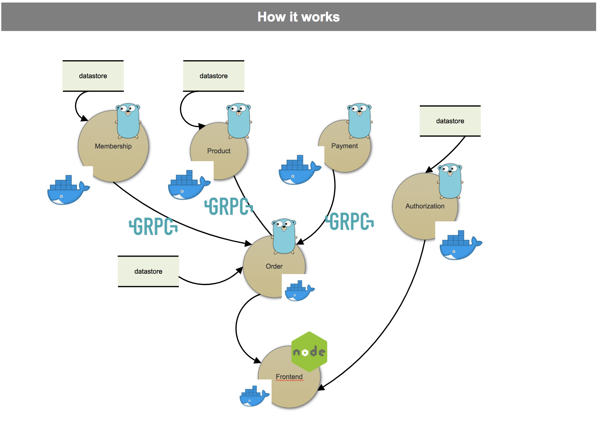

# Mini E-Commerce Build with Go, GRPC, and Microservices Architecture with Multiple Docker Container

Demo(Building E-Commerce Microservice using Golang, Rest and GRPC)

## TODO
- [x] Create API-Gateway Service
- [x] Create Product Service
- [x] Create Auth Service
- [ ] Create Order Service
- [ ] Create Payment Service
- [ ] Create Membership Service

## How to run
- Clone this repository
- Run `docker-compose up --build`
